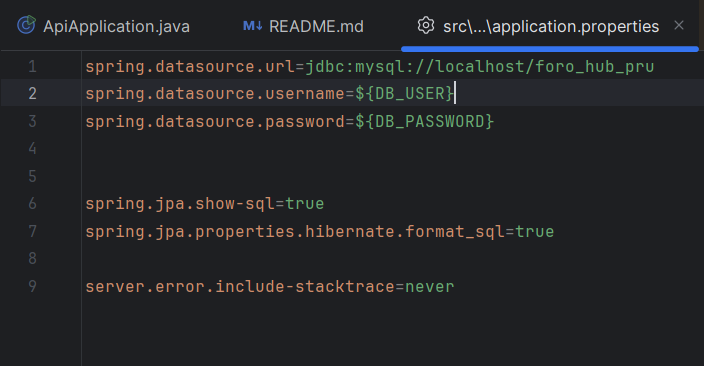
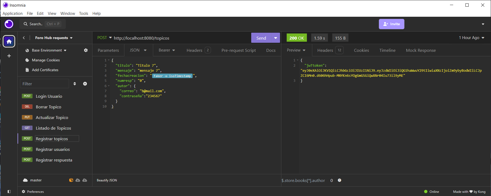
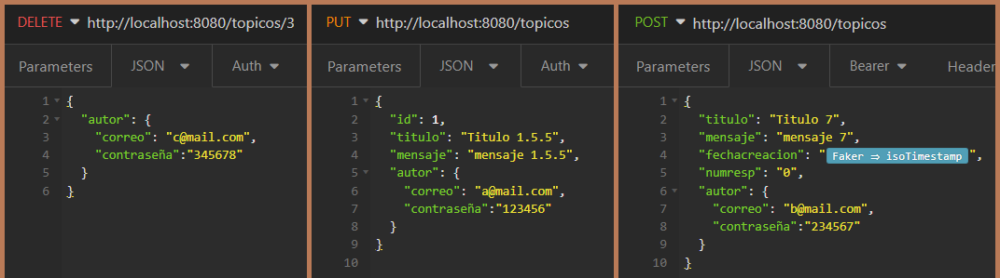
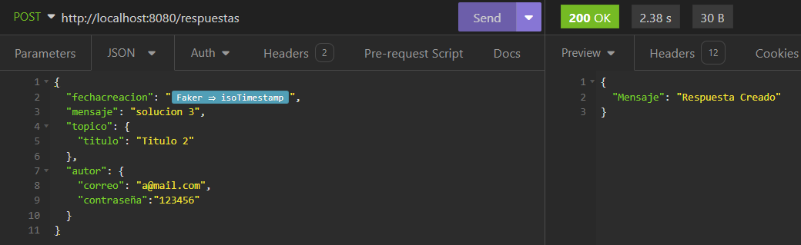

## Practicando Spring Framework Challenge Foro Hub

Generador de Topicos implementando Spring Framework con seguridad e implementación de Insomnia como API.

---

## Uso
1) Cree la base de datos llamada "foro_hub_pru" o el que prefieras y configure el archivo "application.properties" para que coincida la contraseña, usuario y nombre de la Base de Datos.
   
2) Implemente los comando que se encuentra en el archivo txt para la implementacion de Insomnia.
   
3) Tanto para eliminar como crear y actualizar, requieren tener correo y contraseña del usuario dueño del topico para realizar dichas funciones.
   
4) Por ultimo, cuando Insomnia ejecute uno de sus comando recibira una respuesta.
   